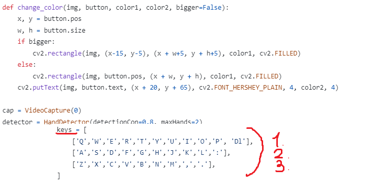

# VirtualKeyBoard 
The project is a virtual keyboard. Everyone can add any keys independently 
# How to add your own keys 
Go to the main.py file. Find the following code section 
 
You can add any keys you want to the keys variable. 
Note!!! Each list represents a line on the keyboard (respectively 1,2,3 lines). The keyboard is designed for 3 lines only. 
